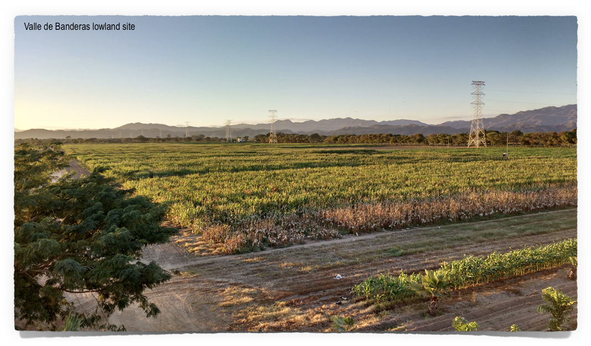

<!-- break -->
 	 
<!-- break -->  

## **G**enetics, **E**volution and **M**etabolism of **M**aize **A**daptation Lab

-----------

**We are at the North Carolina State University, Department of Structural and Molecular Biochemistry.** 

You can find us at Polk Hall, Room 145 (lab) and 148 office or shoot us an email at  rrellan[at]ncsu.edu or call 919-515-4738.

If you are interested in joining our lab please take a look at our [current research areas](http://www.gemmalab.org/research.html) for possible projects. Please read also our [lab philosophy](http://www.gemmalab.org/expectations.html) about what to expect from me and what I would expect from you if we both decided to work together.     

 

 

  

