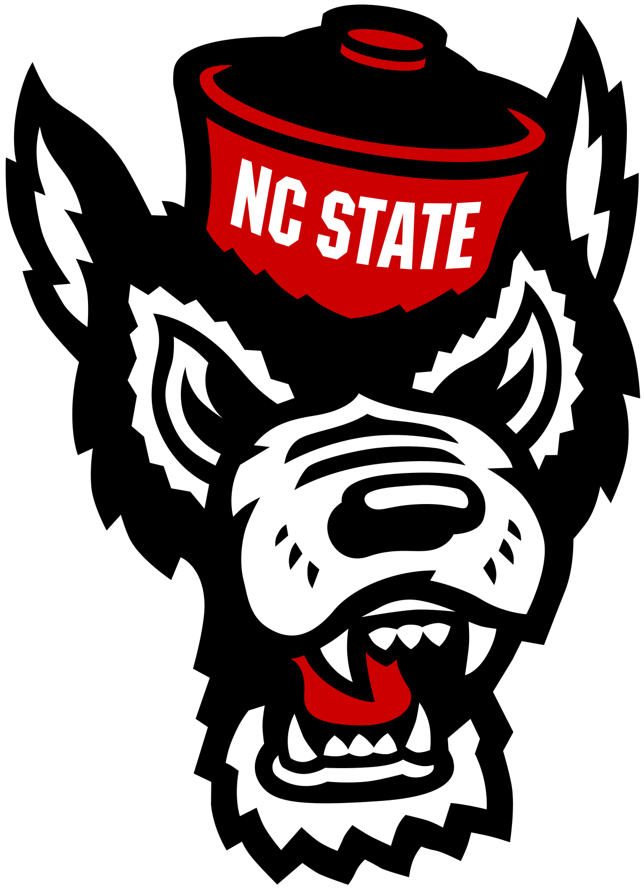
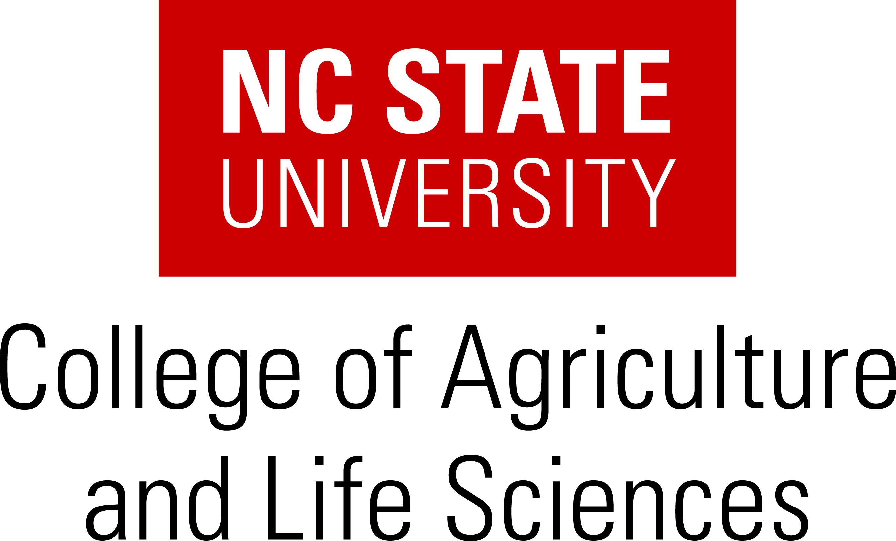

::: {.column-screen}
```{=html}
<div class="hero" style="background-image: url('images/nevado_de_toluca.png');">
  <div>
    <span class="hero-eyebrow">NC State University &middot; Molecular &amp; Structural Biochemistry</span>
    <h1>Genetics, Evolution and Metabolism of Maize Adaptation</h1>
    <p>We study the metabolic and morphological mechanisms that plants have evolved to
    thrive in soils with low nutrient availability — from wild teosinte in the Mexican
    highlands to modern maize and sorghum.</p>
    <div class="hero-actions">
      <a class="btn-gold" href="research.html">Explore our research</a>
      <a class="btn-ghost" href="expectations.html">Join the lab</a>
    </div>
  </div>
</div>
```
:::

## What we work on

::: {.grid-cards}

::: {.card-item}
### Nutrient use efficiency
Finding the alleles and metabolic pathways that let maize and sorghum do more with
less nitrogen and phosphorus — and reduce the environmental cost of fertilizer.
:::

::: {.card-item}
### Local adaptation
Highland maize and its teosinte relatives carry variation lost during domestication.
We map it, and test what it is good for.
:::

::: {.card-item}
### Lipids and metabolism
Glycerolipid remodelling sits at the intersection of cold tolerance and phosphorus
limitation. We use lipidomics, quantitative genetics and population genetics to
understand it.
:::

:::

[See all research areas →](research.qmd)

## Where to find us

::: {.contact-strip}

::: {.contact-item}
[Institution]{.label}
North Carolina State University\
Department of Molecular and Structural Biochemistry
:::

::: {.contact-item}
[Location]{.label}
Polk Hall — Room 134\
Room 145 (Lab) &middot; Room 148 (Office)
:::

::: {.contact-item}
[Get in touch]{.label}
[rrellan@ncsu.edu](mailto:rrellan@ncsu.edu)\
(919) 515-4738
:::

:::

::: {.panel-accent}
### Interested in joining our lab?

We are always glad to hear from prospective students, postdocs and technicians.

- Browse our [current research areas](research.qmd) for potential projects.
- Read about our [lab philosophy and expectations](expectations.qmd) — what we ask of
  you, and what you can ask of us.
- Then email [Rubén Rellán-Álvarez](mailto:rrellan@ncsu.edu).
:::

::: {.logo-row}


:::
