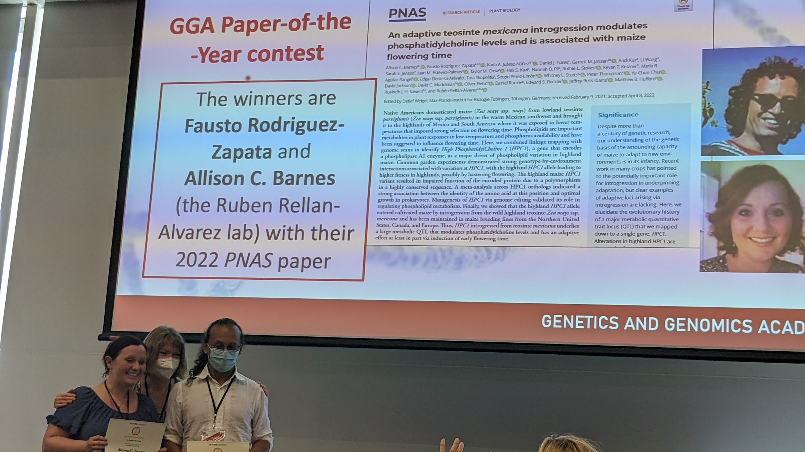

---

### 2023

- Nirwan visited the laboratory of Ed Buckler. 

- Briana Parker and undergraduate student from California State University at Sacramento joined the lab for an REU stay. 

- Aleya Mohammed a student from the Biochemistry major joined the lab. 

- Emily Phung joined the lab to work as lab technician. 

- Rubén visited UC Riverside to give a talk in the Institute for Integrative Genome Biology

- Destiny, Ruthie, Hannah, Nirwan and Rubén attented the Maize Meeting in Saint Louis.

- Fausto passed his prelims!

- Fausto visited our collaborators Jeff Ross-Ibarra and Dan Runcie in UC Davis. 

- Hannah Pil graduated as a Genetics Major and is now working as a full time lab technician. 

- Pascual Blanco is now working as full time field tecnhnician. 

### 2022

- Nirwan Tandukar, a PhD student from the Functional Genomics Program joined the lab to work in the DOE CAREER project in January 2022

- Ruthie Stokes, a PhD student from the Biochemistry program joined the lab in January 2022.

- Fausto and Allison won the Genetics and Genomics Academy paper of the year!

- Ruthie Stokes was accepted into the [AgBioFews program.](https://research.ncsu.edu/ges/academics/agbiofews/students-3/)

- Pascual Blanco joined the lab as a part time field technician. 

### 2020-2021  

Lot's of things happened during this time in the world and our lab. To summarize:

- Destiny Tyson joined our lab as a PhD student co-mentored with Jim Holland. 

- Andi Kur left the lab to start a career in scientific illustration and now as mid-school teacher. Lucky students!  

- We were funded with a DOE CAREER grant to study how to combine diverse geentic mapping datasets to improve our ability to discover candidate genes involved in adaptation to environmental stresses.

- We are part of the team that got funded to start [STEPS](https://steps-center.org/), the Science and Technologies for Phosphorus Sustainability NSF Center. 

- We got a Scientific Exchanges grant from the Foregign Agricultural Service to work with our colleagues in Perú.  

### 2020

- August. Andi Kur joined the lab and will start her PhD in the Genetics program with a fellowship from the AgBioFews Program. 

### 2019

- October 10th Fausto gave a talk at NCSU's Intrynsic group.  

- October 8th Rubén gave a talk at the University of Minnesota Plant and Microbial Biology Department. 

- September 16th Rubén gave a talk at the North Carolina Plant Molecular Biology retreat. 

- August 27th. Rubén gave a talk at NCSU's Plant and Molecular Biology department seminar series

- August 19th. Rubén visited colleagues in La Molina University and INIA in Perú. 

- August 12th. Rubén gave a talk at the Germplasm Enhacement of Maize meeting in Clayton, NC.

- July 15th. Fausto Rodríguez moved from México and started a PhD in the NCSU's genetics graduate program.  

- July 1st. Fabian Santa Maria from the Mexico team spent two months in Raleigh.  

- June 17th. We visited our collaborators from the Steve Kresovich Lab in Florence, SC.  

- June 1st. Allison Barnes joined our lab as a postdoctoral researcher.  

- May 16th. We planted our first nursery in the Upper Mountain Research Station in Laurel Springs.  

- May 15th. Rubén Gave a talk at the Syngenta Plant Stress Symposium at Syngenta headquarters in the Research Triangle Park

- April 29th. We planted our first nursery in the Central Crops Research Station at Clayton.

- April 22nd. Rubén visited UGA in Athens, Georgia to give a talk invited by Alex Bucksch.

- March 14th. We attended the Maize Meeting in St Louis, MO.

- January 24th. We spent two weeks working on our winter nursery in Puerto Vallarta.

- January 1st. **Our lab has moved to the North Carolina State University, Deparment of Structural and Molecular Biochemistry.** 

### 2018

- August 5-10th. Karla gave a talk at the 12th International Plant Molecular Biology Congress in Montepellier. 

- August 2nd. Rubén [gave a talk at the Misión Biológica de Galicia](http://www.mbg.csic.es/) in Pontevedra, Spain.

- July 25th. Rubén [gave a talk at the Aula Dei Experimental Station](http://www.eead.csic.es/spreading/showspreading?Id=771) in Zaragoza, Spain. 

- July 14-19th. Rubén Presented a poster at the ASPB meeting in Montreal. 

- February 14-16th. Rubén visited NCSU to give a talk. 

- February 19-21st. Rubén visited MSU to give a talk. 

- January 13th. Start of the Winter Nursery crossing season. 

- January 12th. Rubén gave a talk at the [MexPopGen](https://mexpopgen.wordpress.com/) meeting organized in Langebio. 

### 2017

- November 13-17th. We were part of the organizing committee of the SMB Plant Biochemistry Meeting in Puerto Vallarta.

- October 23-25th. John Lovell visited us to give a talk and a workshop on QTL mapping.

- July 25th. Rubén gave a talk at ISU´s Genetics and Genomics Graduate Group. Slides [here](https://speakerdeck.com/rellan/towards-and-understanding-of-maize-adaptation-to-highlands-using-a-combination-of-lipidomics-and-quantitative-and-population-genetics).

- July 17th. Rubén is off to Iowa State University to visit [Matt Hufford's lab](http://www.public.iastate.edu/~mhufford/HuffordLab/home.html).  

- June 28th. Sofía Sánchez attended the SEB meeting in Sweeden and presented her work on the *XIPOTL* genes.

- June 17th. Karla Juarez is off to the lab of Christoph Benning at MSU to work on the characterization of a phospholipase candidate gene.

- June 16th. Karla Juarez Nuñez passed her master thesis today!! What a great way to celebrate Barbara McClintock´s birthday. 

- May 26th. Rubén gave a keynote seminar at the Danforth Plant Science Center Retreat. Slides [here](https://speakerdeck.com/rellan/convergent-glycerolipid-metabolism-in-highland-adapted-maize)

- May 4th. Rubén gave a talk at the Plant Biotechnology Ecology and Evolution student seminars series.

- March 12-15. Rubén visited [David Lowry´s lab](https://davidbryantlowry.wordpress.com/) at MSU to give a seminar and discuss future collaborations with
  
- March 9-12. We had a great time at the [maize meeting](http://www.maizegdb.org/maize_meeting/2017/).

- February 27. Elohim passed his qualifying exam! Congrats Elohim.

- February 6 and 8. Rubén gave talks at the Carnegie Plant Biology Department in Stanford and at the Genome Center in UC Davis as part of a trip to meet collaborators in both places and attend the first [ZeaBigData](zeabigdata.org) hackaton.

- January 30. Rubén gave a talk at [Plant Lipids Gordon Research Conference](https://www.grc.org/programs.aspx?id=13966), in Gastonville, Texas.

- January 24. Rubén gave a talk at the Future of Bean and Maize Research meeting in México organized by our colleagues Alejandra Covarrubias and Arnaud Ronceret in the IBT, Cuernavaca.

- January. Several of us headed to Bucerias to work on our Winter Nursery.

### 2016

- December 19. Our collaboration with Luis Herrera-Estrella´s lab on *Malate-dependent Fe accumulation is a critical checkpoint in the root developmental response to low phosphate* is now up on [biorxiv](http://biorxiv.org/content/early/2016/12/19/095497).

- December 12. [Guillaume Lobet](http://plantmodelling.xyz/) visited us briefly before heading to the Phenomics conference at Cimmyt. He gave a talk on how his brand new lab is using plant modelling to understand how plants integrate signals from both soil and the atmosphere to grow.

- October 4. Our white paper on [Morphological plant modeling: Unleashing geometric and topologic potential within the plant sciences](http://biorxiv.org/content/early/2016/10/04/078832) has been uploaded to biorxiv. Great collaborative effort as result of a NimBios workshop last year.

- September 5-7. [Jonathan Lynch](http://plantscience.psu.edu/research/labs/roots) from Penn State visited us and gave a seminar at Langebio. Roots FTW!!
- August 12. My colleagues Jeffrey Ross-Ibarra, Matt Hufford, Sherryl Flint-García, Graham Coop and Ruairidh Sawers got a PGRP-NSF grant to work on [Maize Highland Adaptation](http://www.highlandadaptation.org/) and we will be closely collaborating with them.

- August 5. [UC-Mexus](http://ucmexus.ucr.edu/) has funded our project in collaboration with the [FiehnLab](http://fiehnlab.ucdavis.edu/) to work on the [phospholipid metabolism reorganization in maize adapatation to highland conditions](https://github.com/rr-lab/uc_mexus_16/blob/master/project_plan/uc_mexus_2016_rellan_fiehn.pdf).

- July 28 . Rubén has been awarded an [eLife travel grant](https://elifesciences.org/elife-news/five-more-early-career-researchers-awarded-elife-travel-grants) to attend the 7th [International Crop Science Congress Beijing](http://www.7icsc.com.cn/home.html).

- July 26. [Wolfang Busch](https://www.gmi.oeaw.ac.at/research-groups/wolfgang-busch/) visited our lab and gave a talk on *Approaching The Genetic And Molecular Bases Of Environmental Regulation Of Root Growth*

- July 6. Work led by colleagues José Sebastian and MC Yee at José Dinneny´s lab showing a nice use of GLO-Roots to study how grasses arrest crown root growth [has been published](http://www.pnas.org/content/early/2016/07/14/1604021113.full).

Time lapse showing rapid induction of setaria crown roots (marked with blue arrow)

- June 7. Together with Guillaume Lobet, Malia Gehan and Srikant Srinivasan we are editing an Special Issue on Plant Phenomics for GigaScience. Check the blog article presenting the special issue [here](http://blogs.biomedcentral.com/gigablog/2016/06/07/complexities-modern-plant-phenomics-guest-blog-plant-phenomics-series-guest-editors/). We are very excited to collaborate with the folks at GigaScience on this.
