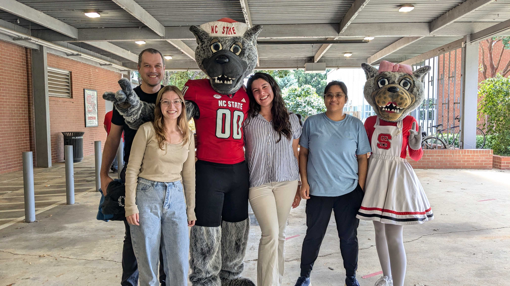

---

<!-- Centered Images -->

  
   
  <strong>Summer 2022 Nursery</strong>
    

  
   
  <strong>Celebrating 100 Years of Crop and Soil Sciences - 2024</strong>

## 🌽 **GEMMA lab crew**
 

**Rubén Rellán-Álvarez** Principal Investigator.  
Rubén is an Assistant Professor at the Biochemistry Department at CALS - NCSU  
</a>  <a href="https://github.com/rellan">
<i class="fa fa-github-alt" aria-hidden="true"></i>
</a> <a href="mailto:rrellan@ncsu.edu">
<i class="fa fa-envelope" aria-hidden="true"></i>
<a href="https://docs.google.com/document/d/1E65ePNEtdPm-f0BjjZN7RnOAzFzaW1RXS_hcn-Y8_Ls/edit?usp=sharing">
<i class="fa fa-file-text" aria-hidden="true"></i>
</a>  

**Fausto Rodríguez Zapata** Postdoc.  
Fausto studies maize glycerolipid quantitative and population genetics and genetic associations with soil variables involved in phosphorus deficiency.  
</a>  <a href="https://github.com/faustovrz">
<i class="fa fa-github-alt" aria-hidden="true"></i>
</a>

**Pascual Blanco** Field Technician.  
Pascual joined the lab in fall 2021. He manages all our field operations.

**Lina López** ORISE Field Techncian.  
Lina joined in fall 2023 to work in the CERCA project in collaboration with Jim Holland.

**Carolina E. Weldt** Lab Manager/Technician.  
Carolina joined the lab in summer 2024.

**Destiny Tyson** PhD Student, Genetics Program. Co-advised with Jim Holland.    
Destiny joined the lab in Fall 2020. She is working on developing gene editing approaches to study maize photoperiod adaptation. 

**Nirwan Tandukar** PhD Student, Genetics Program.     
Nirwan joined the lab in January 2022. He is working on the development of approaches that use multiple genetic datasets to identify genes in adaptation to abiotic stresses.   

**Hannah Pil** PhD Student, Genetics Program.   
Hannah joined the lab in summer 2021 as an undergraduate and since then [she has become a master corn pollinator](https://photos.app.goo.gl/B7gZ5gMczcBoPXcG6).

**Zehta Glover** PhD Student, Genetics Program.     
Zehta joined the lab in December 2024. She is working on the genetic mechanisms that drive cold stress tolerance, with an emphasis on evolutionary diversity in maize.

**Lauren Insko** PhD Student, Structural and Molecular Biochemistry Program.     
Lauren joined the lab in January 2025. She is working on identifying regulatory elements of the gene *High PhosphatidylCholine 1* as well as identifying structural elements of the phospholipase protein product.  

**Isaac Fleming** PhD Student, Crop Science. Co-adviced with Alex Woodley.  
Isaac joined the lab in January 2025. He is working on Biological nitrification in maize.
 

### **Former lab members**  
 

**Allison Barnes** Postdoc. 

**Ruthie Stokes** Master Student

**Ryan Pil** Undergraduate student

**Aleya Mohammed** Undergraduate student

**Shannon Persaud** Undergraduate student 

**Emily Phung** Lab Technician

**Heli Kavi** Undergraduate student

**Elohim Bello**. PhD Student *co-advised with Luis Herrera-Estrella*.

**Jessica Carcaño** *Administrative assistant*  

**Jonathan Ojeda**. PhD Student *co-advised with Luis Herrera-Estrella*.  

**Fabián Santa Maria** Master Student *co-advised with Luis Delaye*

**Andi Kur** PhD Student. NCSU Genetics program. AgBioFews Program.

**Christina Merkel** Lab Tech   

**Patricio Cid** Field Manager  

**Juan Estévez** Wet Lab Manager  

**Karla Juarez** Master Student  

**Sofía Estefany Sánchez** Master Student *co-advised with Ruairidh Sawers*. 

**Vladimir Torres**. Master Student *co-advised with Ruairidh Sawers*.    

**Christian Escoto**. Master Student *co-advised with Ruairidh Sawers*.   

**Dario Alávez** Lab Technician