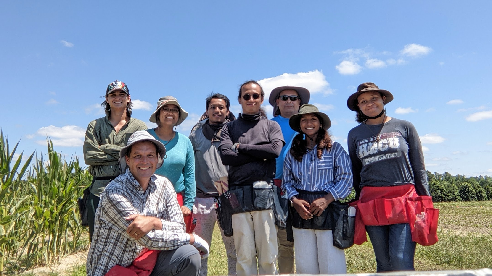
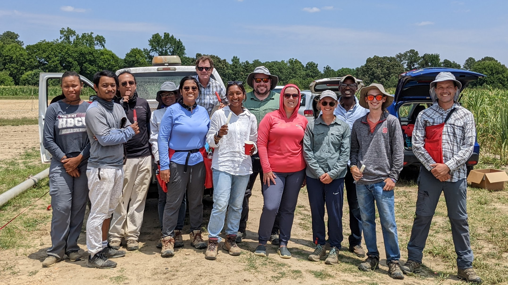
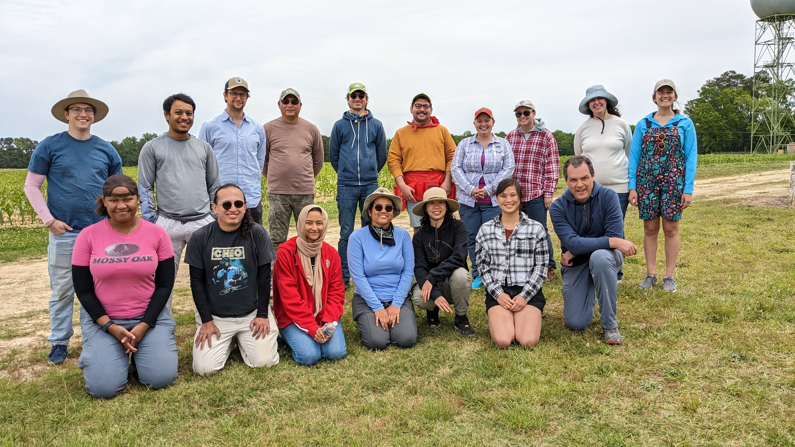
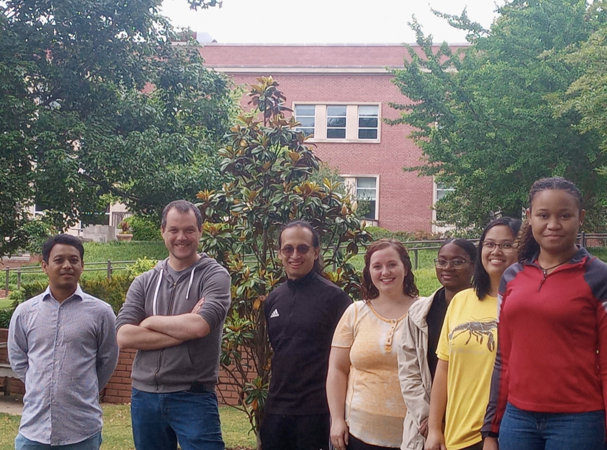

---

**Summer 2022 Nursery**

 

**With the Holland lab enjoying the classic 4th of July Popsicles**

 

**Sampling for lipidomics and RNA-Seq with the Gage and Strable labs**

 

**Lab in May 2022**

 

## Current members of the lab, August 2023

**Allison Barnes** Postdoc.   
Allison joined the lab in NCSU in June 2019. Among other things she is working in the functional characterization of a maize phospholipase.  
<a href="https://twitter.com/asiekmanbarnes">
<i class="fa fa-twitter" aria-hidden="true"></i>
</a>  

**Pascual Blanco** Field Technician.
Pascual joined the lab in the Fall of 2021. He manages all our field operations. 

**Aleya Mohammed** Undergraduate student. Biochemistry Major.
Aleya joined the lab in the Spring of 2023. 

**Shannon Persaud** Undergraduate student. Genetics Major.
Shannon joined the lab in the Summer of 2022. 

**Emily Phung** Lab Technician. Emily joined the lab in the Spring of 2023. She manages several abiotic stress screens of our teosinte introgression populations. 

**Hannah Pil** Lab Manager/Technician.
Hannah joined the lab in the Summer of 2021 as an undergraduate and since then [she has become a master corn pollinator](https://photos.app.goo.gl/B7gZ5gMczcBoPXcG6). She is currently working as a lab manager/technician before she starts her PhD in Genetics in the Fall of 2023.

 
**Rubén Rellán-Álvarez. PI**  
Rubén is an Assistant Professor at the Biochemistry Department at CALS - NCSU  
</a>  <a href="https://github.com/rellan">
<i class="fa fa-github-alt" aria-hidden="true"></i>
</a> <a href="mailto:rrellan@ncsu.edu">
<i class="fa fa-envelope" aria-hidden="true"></i>
<a href="https://docs.google.com/document/d/1E65ePNEtdPm-f0BjjZN7RnOAzFzaW1RXS_hcn-Y8_Ls/edit?usp=sharing">
<i class="fa fa-file-text" aria-hidden="true"></i>
</a>  

**Fausto Rodríguez Zapata** PhD Student. NCSU Genetics program. STEPS Center.  
Fausto studies maize glycerolipid quantitative and population genetics and genetic associations with soil variables involved in phosphorus deficiency.  
<a href="https://twitter.com/chyscamuy">
<i class="fa fa-twitter" aria-hidden="true"></i>
</a>  <a href="https://github.com/faustovrz">
<i class="fa fa-github-alt" aria-hidden="true"></i>
</a>

**Ruthie Stokes** PhD Student, Biochemistry Program   
Ruthie joined the lab in the Fall of 2021 and is working on the characterization of lipid-protein interactions.  

**Nirwan Tandukar** PhD Student, Genetics Program.     
Nirwan joined in the lab in January 2022. He is working on the development of approaches that use multiple genetic datasets to identify genes in adaptation to abiotic stresses.   

**Destiny Tyson** PhD Student, Genetics Program. Co-advised with Jim Holland.    
Destiny joined the lab in the Fall of 2020. She is working on developing gene editing approaches to study maize photoperiod adaptation.    

### Former lab members  

**Heli Kavi** Undergraduate student.

**Elohim Bello**. PhD Student *co-advised with Luis Herrera-Estrella*  

**Jessica Carcaño** *Administrative assistant*.  

**Jonathan Ojeda**. PhD Student *co-advised with Luis Herrera-Estrella*.  
<a href="https://twitter.com/jonojedarivera">
<i class="fa fa-twitter" aria-hidden="true"></i>
</a>  

**Fabián Santa Maria** Master Student *co-advised with Luis Delaye*.   

**Andi Kur** PhD Student. NCSU Genetics program. AgBioFews Program.   
<a href="https://twitter.com/Andi_Kur_">
<i class="fa fa-twitter" aria-hidden="true"></i>
</a>  

**Christina Merkel** Lab Tech   

**Patricio Cid** *Field Manager*.  

**Juan Estévez** *Wet Lab Manager*.  

**Karla Juarez** *Master Student*.   

**Sofía Estefany Sánchez** Master Student *co-advised with Ruairidh Sawers*. 

**Vladimir Torres**. Master Student *co-advised with Ruairidh Sawers*.    

**Christian Escoto**. Master Student *co-advised with Ruairidh Sawers*.   

**Dario Alávez** *Lab Technician*. 