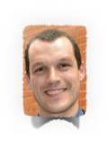

<!-- break -->
 
<!-- break -->

Lab Members
-------------
<!-- break -->
 
<!-- break -->

  
</a>

**Elohim Bello**. PhD Student *co-advised with Luis Herrera-Estrella*  
Elohim studies natural variation of root soil penetration using Arabidopsis.

<!-- break -->
   
<!-- break -->

**Jessica Carcaño** *Administrative assistant*.  
Jessy helps to run our lab and Ruairidh Sawers' and Stewart Gillmor´s labs.   

<!-- break -->
   
<!-- break -->

**Patricio Cid** *Field Manager*.  
Patricio directs all the field operations of our lab and of ours and Sawers' labs.  
<a href="https://twitter.com/patriciocidcc">
<i class="fa fa-twitter fa-2x" aria-hidden="true"></i>
</a> <a href="https://www.linkedin.com/in/patriciocid/">
<i class="fa fa-linkedin fa-2x" aria-hidden="true"></i>
</a>

<!-- break -->
   
<!-- break -->

**Juan Estévez** *Wet Lab Manager*.  
Juan runs all the big genotyping, GBSing and cloning of our and Sawers´ labs.     

<!-- break -->
   
<!-- break -->

**Karla Juarez** *Master Student*.   
Karla studies the role of phospholipids in maize adaptation to low phosphorus and low temperature.  
<a href="https://twitter.com/KarlaJuarez30">
<i class="fa fa-twitter fa-2x" aria-hidden="true"></i>
</a>
<!-- break -->
   
<!-- break -->

**Jonathan Ojeda**. PhD Student *co-advised with Luis Herrera-Estrella*.  
Jonathan is studying an Arabidopsis mutant that shows indeterminate primary root growth in low Phosphorus conditions.  
<a href="https://twitter.com/jonojedarivera">
<i class="fa fa-twitter fa-2x" aria-hidden="true"></i>
</a>
<!-- break -->
   
<!-- break -->  

**Rubén Rellán-Álvarez. PI**  
Rubén is a professor at Plant Biotechnology and Integrative Biology graduate programs. He started his lab in Langebio in 2015.  
<a href="https://twitter.com/rrellanalvarez">
<i class="fa fa-twitter fa-2x" aria-hidden="true"></i>
</a>  <a href="https://github.com/rellan">
<i class="fa fa-github-alt fa-2x" aria-hidden="true"></i>
</a> <a href="mailto:rubenrellan@gmail.com">
<i class="fa fa-envelope fa-2x" aria-hidden="true"></i>
</a>

<!-- break -->
   
<!-- break -->

**Sofía Estefany Sánchez** Master Student *co-advised with Ruairidh Sawers*.   
Sofía is working with the *xipotl* family of genes in maize a set of genes that are involved in the methylation pathway of phosphatidylcholine.  

<!-- break -->
   
<!-- break -->

### Former lab members  

**Vladimir Torres**. Master Student *co-advised with Ruairidh Sawers*.    
Vladimir studied how an introgression of Teosinte parviglumis in B73 affects root growth and phoshorus deficiency. He is currently doing his PhD with Ruairidh Sawers.  

**Christian Escoto**. Master Student *co-advised with Ruairidh Sawers*.   
Christian is working in the analysis of different morphological traits affected by Phosphorus deficiency using a CML228 x B73 RIL mapping population.  

**Dario Alávez**. Dario worked as lab and field tech mainly developing a collection of Uniform-Mu mutants targetting a number of glycerolipid sysnthesis and degradation genes.
