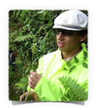
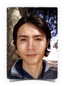

<!-- break -->
 
<!-- break -->

Lab Members
-------------

<!-- break -->
   
<!-- break -->  

**Rubén Rellán-Álvarez. PI**  
Rubén is a professor at Plant Biotechnology and Integrative Biology graduate programs. He started his lab in Langebio in 2015.  
<a href="https://twitter.com/rrellanalvarez">
<i class="fa fa-twitter fa-2x" aria-hidden="true"></i>
</a>  <a href="https://github.com/rellan">
<i class="fa fa-github-alt fa-2x" aria-hidden="true"></i>
</a> <a href="mailto:rrellan@ncsu.edu">
<i class="fa fa-envelope fa-2x" aria-hidden="true"></i>
<a href="https://docs.google.com/document/d/1E65ePNEtdPm-f0BjjZN7RnOAzFzaW1RXS_hcn-Y8_Ls/edit?usp=sharing">
<i class="fa fa-file-text fa-2x" aria-hidden="true"></i>
</a>

<!-- break -->
   
<!-- break -->  

**Fausto Rodríguez Zapata** PhD Student.   
Fausto will studies maize glycerolipid quantitative and population genetics and genetic associations with soil variables involved in phosphorus deficiency.
<a href="https://twitter.com/chyscamuy">
<i class="fa fa-twitter fa-2x" aria-hidden="true"></i>
</a>

### Team in México  

<!-- break -->
   
<!-- break -->

  
</a>

**Elohim Bello**. PhD Student *co-advised with Luis Herrera-Estrella*  
Elohim studies natural variation of root soil penetration using Arabidopsis.  

<!-- break -->
   
<!-- break -->

**Jessica Carcaño** *Administrative assistant*.  
Jessy helps to run our lab and Ruairidh Sawers' and Stewart Gillmor´s labs.  

<!-- break -->
   
<!-- break -->

**Jonathan Ojeda**. PhD Student *co-advised with Luis Herrera-Estrella*.  
Jonathan is studying an Arabidopsis mutant that shows indeterminate primary root growth in low Phosphorus conditions.  
<a href="https://twitter.com/jonojedarivera">
<i class="fa fa-twitter fa-2x" aria-hidden="true"></i>
</a>

<!-- break -->
   
<!-- break -->

**Fabián Santa Maria** Master Student *co-advised with Luis Delaye*.   
Fabian works on *xipotl* genes, involved in phosphatydilcholine biosynthesis and in *opr7/opr8* involved in jasmonic acid biosynthesis   
<!-- break -->
   
<!-- break -->

### Former lab members  

**Patricio Cid** *Field Manager*.  
Patricio directed all the field operations of our lab and of ours and Sawers' labs.  

**Juan Estévez** *Wet Lab Manager*.  
Juan ran all the big genotyping, GBSing and cloning of our and Sawers´ labs.  

**Karla Juarez** *Master Student*.   
Karla studied the role of phospholipids in maize adaptation to low phosphorus and low temperature.  

**Sofía Estefany Sánchez** Master Student *co-advised with Ruairidh Sawers*. Sofía worked with the *xipotl* family of genes in maize a set of genes that are involved in the methylation pathway of phosphatidylcholine.  

**Vladimir Torres**. Master Student *co-advised with Ruairidh Sawers*.    
Vladimir studied how an introgression of Teosinte parviglumis in B73 affects root growth and phoshorus deficiency. He is currently doing his PhD with Ruairidh Sawers.  

**Christian Escoto**. Master Student *co-advised with Ruairidh Sawers*.   
Christian worked in the analysis of different morphological traits affected by Phosphorus deficiency using a CML228 x B73 RIL mapping population.  

**Dario Alávez**. Dario worked as lab and field tech mainly developing a collection of Uniform-Mu mutants targetting a number of glycerolipid sysnthesis and degradation genes.
