::: {.lede}
The lab brings together plant biochemists, quantitative geneticists, field
technicians and computational biologists working on maize, sorghum and their
wild relatives.
:::

## The crew

::: {.people-grid}

::: {.person}
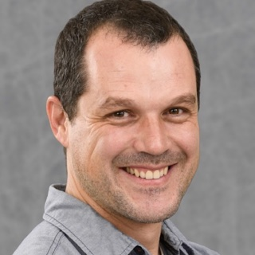{.person-photo}

[Rubén Rellán-Álvarez]{.person-name}
[Principal Investigator]{.person-role}

::: {.person-bio}
Associate Professor in the Department of Molecular and Structural Biochemistry
at NC State.
:::

::: {.person-links}
[<i class="bi bi-github"></i>](https://github.com/rellan "GitHub")
[<i class="bi bi-envelope"></i>](mailto:rrellan@ncsu.edu "Email")
[<i class="bi bi-file-text"></i>](https://docs.google.com/document/d/1E65ePNEtdPm-f0BjjZN7RnOAzFzaW1RXS_hcn-Y8_Ls/edit?usp=sharing "CV")
[<i class="bi bi-mortarboard"></i>](https://scholar.google.com.mx/citations?user=hdSIEUAAAAAJ&hl=en "Google Scholar")
:::
:::

::: {.person}
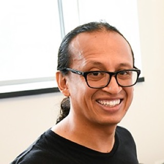{.person-photo}

[Fausto Rodríguez-Zapata]{.person-name}
[Postdoc]{.person-role}

::: {.person-bio}
Fausto studies maize glycerolipid quantitative and population genetics, and
genetic associations with soil variables involved in phosphorus deficiency.
:::

::: {.person-links}
[<i class="bi bi-github"></i>](https://github.com/faustovrz "GitHub")
:::
:::

::: {.person}
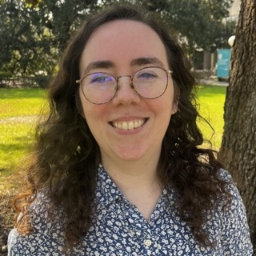{.person-photo}

[Jill Love]{.person-name}
[Postdoc]{.person-role}

::: {.person-bio}
Jill joined the lab in 2026.
:::
:::

::: {.person}
{.person-photo}

[Nirwan Tandukar]{.person-name}
[Postdoc]{.person-role}

::: {.person-bio}
Nirwan joined the lab in January 2022 as a PhD student, completed his PhD in
July 2026 and is now a postdoc in the lab. He develops approaches that combine
multiple genetic datasets to identify genes involved in adaptation to abiotic
stresses, and built the
[Sorghum Lipid Database](https://nirwan.shinyapps.io/SAP-Lipidomics-Database/).
:::
:::

::: {.person}
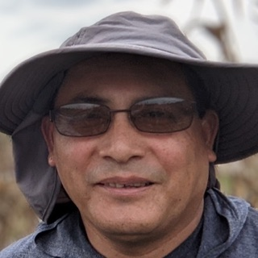{.person-photo}

[Pascual Blanco]{.person-name}
[Field Technician]{.person-role}

::: {.person-bio}
Pascual joined the lab in fall 2021. He manages all our field operations.
:::
:::

::: {.person}
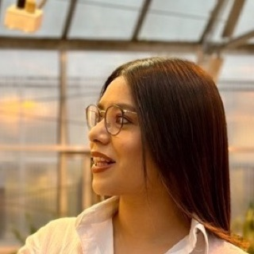{.person-photo}

[Lina López-Corona]{.person-name}
[Project Manager, ARPA-E NSave Maize project]{.person-role}

::: {.person-bio}
Lina joined the lab in fall 2023.
:::
:::

::: {.person}
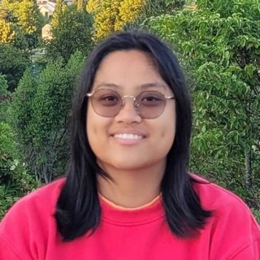{.person-photo}

[Hannah Pil]{.person-name}
[PhD Candidate, Genetics Program]{.person-role}

::: {.person-bio}
Hannah joined the lab in summer 2021 as an undergraduate and since then
[she has become a master corn pollinator](https://photos.app.goo.gl/B7gZ5gMczcBoPXcG6).
:::
:::

::: {.person}
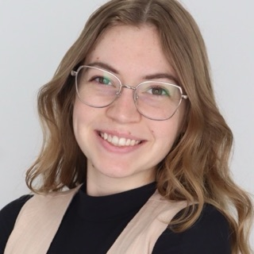{.person-photo}

[Zehta Fazler]{.person-name}
[PhD Student, Genetics Program]{.person-role}

::: {.person-bio}
Zehta joined the lab in December 2024. She works on the genetic mechanisms that
drive cold stress tolerance, with an emphasis on evolutionary diversity in maize.
:::
:::

::: {.person}
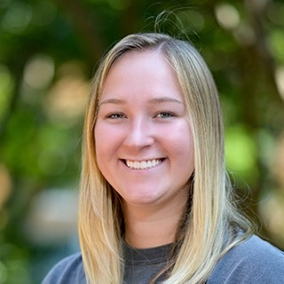{.person-photo}

[Lauren Insko]{.person-name}
[PhD Student, Structural and Molecular Biochemistry]{.person-role}

::: {.person-bio}
Lauren joined the lab in January 2025. She works on identifying regulatory
elements of the gene *High PhosphatidylCholine 1*, as well as structural elements
of the phospholipase protein product.
:::
:::

::: {.person}
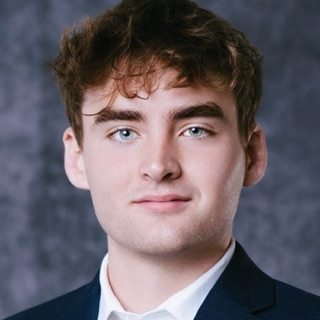{.person-photo}

[Brock Davis]{.person-name}
[Undergraduate Researcher, Genetics major]{.person-role}

::: {.person-bio}
Brock joined the lab in 2025.
:::
:::

::: {.person}
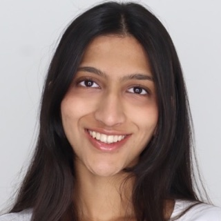{.person-photo}

[Sanaa Jain]{.person-name}
[Undergraduate Researcher, Biochemistry major]{.person-role}

::: {.person-bio}
Sanaa joined the lab in 2026 through the SAPLINGs program.
:::
:::

::: {.person}
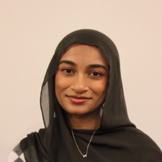{.person-photo}

[Maheera Hassan]{.person-name}
[Undergraduate Researcher, Genetics major]{.person-role}

::: {.person-bio}
Maheera joined the lab in 2026.
:::
:::

::: {.person}
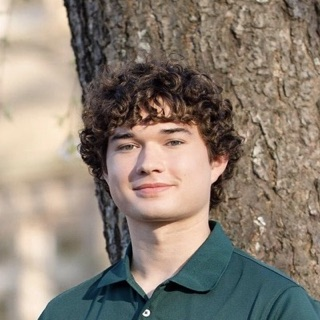{.person-photo}

[Sam Strimple]{.person-name}
[Undergraduate Researcher, Genetics major]{.person-role}

::: {.person-bio}
Sam joined the lab in 2026.
:::
:::

:::

## Former lab members

::: {.alumni-list}
- **Carolina Escalona-Weldt** [Lab Manager / Technician]{.alum-role}
- **Trinity McCleary** [Undergraduate Student, STEPS REU]{.alum-role}
- **Youngeun Kim** [Visiting student from South Korea (until January 2026)]{.alum-role}
- **Destiny Tyson** [PhD Student, Genetics Program — co-advised with Jim Holland]{.alum-role}
- **Allison Barnes** [Postdoc]{.alum-role}
- **Ruthie Stokes** [Master's Student]{.alum-role}
- **Ryan Pil** [Undergraduate Student]{.alum-role}
- **Aleya Mohammed** [Undergraduate Student]{.alum-role}
- **Shannon Persaud** [Undergraduate Student]{.alum-role}
- **Emily Phung** [Lab Technician]{.alum-role}
- **Heli Kavi** [Undergraduate Student]{.alum-role}
- **Elohim Bello** [PhD Student — co-advised with Luis Herrera-Estrella]{.alum-role}
- **Jessica Carcaño** [Administrative Assistant]{.alum-role}
- **Jonathan Ojeda** [PhD Student — co-advised with Luis Herrera-Estrella]{.alum-role}
- **Fabián Santa María** [Master's Student — co-advised with Luis Delaye]{.alum-role}
- **Andi Kur** [PhD Student, NCSU Genetics Program, AgBioFEWS Program]{.alum-role}
- **Christina Merkel** [Lab Technician]{.alum-role}
- **Patricio Cid** [Field Manager]{.alum-role}
- **Juan Estévez** [Wet Lab Manager]{.alum-role}
- **Karla Juárez** [Master's Student]{.alum-role}
- **Sofía Estefany Sánchez** [Master's Student — co-advised with Ruairidh Sawers]{.alum-role}
- **Vladimir Torres** [Master's Student — co-advised with Ruairidh Sawers]{.alum-role}
- **Christian Escoto** [Master's Student — co-advised with Ruairidh Sawers]{.alum-role}
- **Darío Alávez** [Lab Technician]{.alum-role}
:::

## The lab in the field

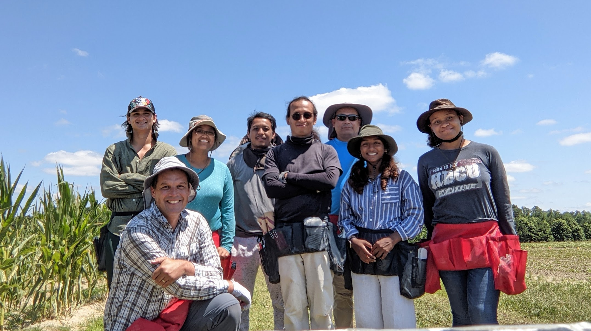{fig-align="center" width="700"}

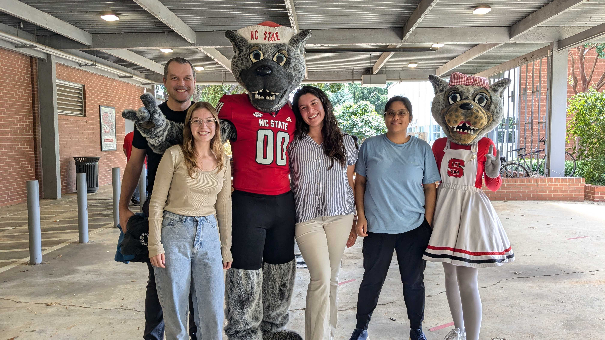{fig-align="center" width="700"}
