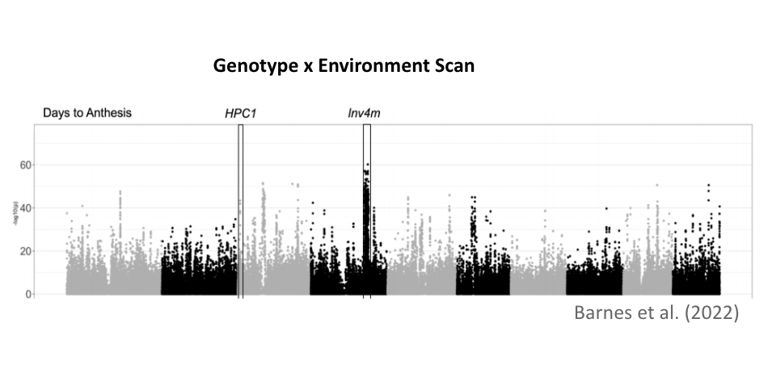

---

We are broadly interested in understanding the metabolic and morphological mechanisms that plants have developed to adapt to soils with low nutrient availability. See below the major research interests of our lab. 

### 🌽 NSave Maize: **N**$_2$O **S**uppression and **A**mmonium a**V**ailability **E**nhancement

The University of Illinois, Urbana-Champaign (UIUC), in collaboration with North Carolina State University, the University of Arizona, and Oak Ridge National Lab, is developing NSave corn to reduce greenhouse gas emissions and enhance sustainability. By integrating traits from wild and modern corn, NSave seeks to lower nitrous oxide emissions by 50%, decrease fertilizer use by 55%, and sustain high yields. Field trials and advanced modeling will assess its economic and environmental impacts, while partnerships with industry aim to promote widespread adoption and advance climate-resilient agriculture.  
 

### 🌽 Nitrogen Use Efficiency and Phosphorus Use Efficiency in Maize and Sorghum

Nitrogen Use Efficiency (NUE) and Phosphorus Use Efficiency (PUE) are critical measures of how effectively crops utilize nitrogen and phosphorus, two essential nutrients for plant growth. NUE and PUE refers to the ability of a plant to produce biomass or grain per unit of N or P available in the soil respectively. Both are essential for enhancing crop productivity, particularly in maize and sorghum, which serve as key staple crops globally. Improving NUE and PUE is crucial not only for boosting food production to meet the demands of a growing global population but also for mitigating the environmental consequences of excessive fertilizer use. High fertilizer application often leads to nutrient runoff, water pollution, and soil degradation. Our research focuses on reducing N and P content in maize and sorghum seeds, which can lead to a decreased reliance on chemical fertilizers. By optimizing nutrient allocation within the plant, we aim to improve nutrient use efficiency. Through population genetics analysis and GWAS, we have identified several alleles and genes that regulate nutrient uptake, translocation, and utilization.  
 

### 🌽 CRISPR-Cas9-mediated knockout to reduce phosphorus in grains

Phosphorus is an essential nutrient for maize productivity, with a significant portion being allocated to the grains and subsequently removed during harvest. However, the primary form of phosphorus in maize grains, phytate, is indigestible by humans, leading to its excretion and contributing to the eutrophication of aquatic ecosystems. Reducing phosphorus accumulation in maize grains is therefore critical for promoting sustainable agricultural practices. This study utilizes CRISPR-Cas9 gene editing technology to knock out specific genes involved in phosphorus accumulation, aiming to mitigate its environmental impact while maintaining maize productivity.  
 

### 🌽 Exploring nitrogen-recycling alleles from *Zea diploperennis*

Maize is largely inefficient with nitrogen, leading to significant contributions to N$_2$O, a prominent greenhouse gas. We expect *Z. diploperennis*, a perennial teosinte species, to harbor nutrient recycling alleles useful for improving maize nitrogen use efficiency. To investigate this, we are assessing lines derived from *Z. diploperennis* generated as part of a large population of teosinte introgressed into maize. By planting them in nitrogen sufficient and deficient conditions, we can use hyperspectral reflectance, a reliable, nondestructive method of evaluating physiological traits, to evaluate these lines for nitrogen content. We hope to discover interesting *Z. diploperennis* regions that confer a notable change in N content.  
 

### 🌽 Transcriptomic and phenotypic analysis of highland maize alleles to improve cold tolerance

Early maize planting can improve nitrogen uptake and reduce emissions, but it also increases exposure to cold temperatures, which limits growth and yield. Highland maize varieties from Mexico, like Palomero Toluqueño, contain unique alleles that have been lost during maize domestication. These alleles may be key to improving cold tolerance in modern maize. To investigate this, we are analyzing recombinant inbred lines (RILs) derived from a cross between Palomero Toluqueño and a commercial maize line. Through transcriptomic analysis and phenotypic evaluations of cold stress responses, we aim to uncover alleles and pathways that could enhance maize cold resilience, enabling earlier planting and better adaptation to fluctuating climates.  

  

  
 

### 🌽 Structural characterization of HPC1 in highland maize

Previously, we have characterized the HPC1 gene, or High PhosphatidylCholine 1, and mapped its location within the maize genome. This gene was introgressed from teosinte mexicana and encodes for phospholipase A1, an enzyme that cleaves phosphatidylcholine, PC, to lysophosphatidylcholine, LPC. PC is capable of packing more tightly within the membrane, whereas  LPC has a more fluid structure. In colder conditions, high levels of LPC in the cell membrane will result in cellular damage; this is something that can be combated with higher quantities of PC which is better suited for a stable membrane bilayer. Highland maize were found to have a SNP within the coding region of HPC1 that mutates the flap lid and prevents functionality in the enzyme product. This contains a catalytic triad that is covered by a flap lid that facilitates substrate binding. Although the structure of phospholipase A1 has been predicted, it has yet to be crystalized to verify structural predictions regarding enzyme functionality. Finding a means to manipulate or select for these important structural components will help to create more adaptive maize.   
 

### 🌽 Testing adaptive value of highland teosinte introgression into maize

This research employs genetic analysis to understand the impact of highland teosinte introgression in maize local adaptation. Through genome scans of Mexican traditional varieties and linkage mapping in controlled crosses, I investigated two key regions from teosinte mexicana: the phospholipase gene HPC1 and the chromosomal inversion Inv4m. These loci exhibit strong genotype-by-environment interaction affecting flowering time. Mechanistic studies suggest that HPC1 modulates flowering through phospholipid metabolism, while Inv4m might accelerate flowering via a gene network controlling cell proliferation and shoot apical meristem transition, showing how teosinte mexicana alleles could enhance stress tolerance and reproductive fitness.  

  

  

 

### 🌽 Harnessing Lipidomics for Enhanced Sorghum Stress Tolerance

Our research leverages lipidomics to find the most important molecular mechanisms that enhance sorghum's resilience to multiple stress conditions. Using a 400-genotype Sorghum Association Panel, we conducted a comprehensive lipidomics analysis across control, and low phosphorus, low nitrogen, and cold stress environment which we define as low-input environment. By analyzing the lipid profiles under each condition, we identified stress-responsive lipids and performed Genome-Wide Association Studies for each lipid, enabling us to pinpoint genetic loci linked to lipid-mediated stress adaptation. These candidate genes, now under validation, are being tested for their role in multi-stress tolerance through functional assays and molecular analysis.   
 

### 🌽 Predictive Modeling for Adaptive Genotype Selection and Cross-Species Knowledge Transfer

We employ machine learning approaches to predict genotype-environment interactions and enhance selective breeding strategies for maize and sorghum. By integrating high-resolution genomic data from landraces with environmental variables like nitrogen and phosphorus in soil, we aim to model the adaptive potential of untested genotypes. This enables us to computationally infer the optimal nitrogen (N) and phosphorus (P) conditions for diverse genotypic backgrounds, allowing for precision selection of mapping populations for field validation. We are also working on deep learning architectures, including transfer learning frameworks, to bridge metabolomics and lipidomics knowledge across species specifically maize and sorghum. By training predictive models on one species and fine-tuning them for another, we exploit shared biochemical and regulatory patterns, unlocking scalable insights into stress adaptation and metabolic plasticity.  
 

### 🌽 BZea: A diverse teosinte introgression population for discovering agronomically relevant alleles in maize

Teosinte, the wild ancestor of maize, harbors a rich reservoir of interesting traits that have been largely diminished during maize domestication. Recognizing the potential of these unknown alleles, we have developed a large teosinte introgression population that consists of 81 georeferenced teosinte accessions crossed into the temperate inbred line B73. Evaluating the impact of teosinte alleles on agronomic traits is inherently difficult due to the differences in photoperiod and growth habitat of maize. This population, “BZea,” addresses this challenge by creating BC$_2$S$_3$s with B73, creating derived lines with 12.5% of the original teosinte donors. Introgression into B73 allows for the evaluation of teosinte alleles in a maize background in temperate conditions.  
 

### 🌽 Genetic and phenotypic characterization of wild teosinte alleles introgressed into elite maize line CML311

This research focuses on the genetic and phenotypic characterization of wild teosinte alleles introgressed into the elite maize line CML311. Using 2,208 near-isogenic lines (NILs) derived from crosses between 85 teosinte plants (from 78 wild populations spanning nearly all Zea taxa) and the tropical maize line CML311, the goal is to investigate the potential of the wild alleles to improve modern maize. Introgressions were mapped  using  sequencing  techniques,  and  phenotypic  evaluations  in  three  Mexican  environments analyzed the consistency of QTLs among teosinte donors.  
 

### 🌽 Genetics of glycerolipid metabolism in highland maize

Maize (*Zea mays*) originated from Balsas teosinte (*Zea mays ssp. parviglumis*) in southwest Mexico around 9,000 years ago, with a secondary subspecies, Chalco teosinte (*Zea mays ssp. mexicana*), found in the cooler, drier highlands of central Mexico. After domestication, maize spread to the Mexican highlands, potentially benefiting from introgression with mexicana. Maize later migrated to South America, where a second highland colonization event occurred in the Andes.

In both Mesoamerican and South American highlands, maize adapted to harsh environmental conditions, including higher radiation, lower air pressure, and temperature, as well as volcanic Andosol soils with low phosphorus bioavailability. This colonization serves as an ideal model for studying plant local adaptation and convergence/divergence in similar environments.

Maize adapted to phosphorus-limiting soils through metabolic strategies, such as recycling phosphorus-containing compounds like RNA and phospholipids. Phospholipids, especially phosphatidylcholine, are crucial for membrane structure and function, including responses to environmental stimuli. In low-temperature conditions, plants increase phospholipids in membranes to modulate fluidity, while under phosphorus deficiency, they substitute phospholipids with galactolipids and sulfolipids. We hypothesize that maize's glycerolipid metabolism underwent strong selective pressure during its adaptation to the Mexican highlands.

Through quantitative genetics analysis of glycerolipid metabolism in maize from various mapping populations grown in highland and lowland conditions, we aim to identify loci involved in lipid remodeling in highland maize.  
 

### 🌽 Improving candidate gene discovery by combining multiple genetic mapping datasets  

Identifying genes involved in plant adaptation to local habitats and environmental stresses is a key goal for plant scientists, aiding in crop breeding and understanding plant development, evolution, and stress responses. However, validating gene function and determining the impact of different gene variants is complex, especially when multiple genes contribute to a trait. This project aims to investigate the effects of phosphorus deficiency and cold stress on sorghum lipid metabolism and develop mathematical approaches to integrate data from genome-wide association studies and population genetics. By combining metabolic profiling of sorghum lines under stress with genetic differentiation from geolocated natural populations, the project seeks to identify and prioritize candidate genes and metabolic pathways. These methods can be applied to bioenergy crops and other environmental stresses.  

 
Have questions or want to know more? Reach out to [Dr. Rellán-Álvarez](mailto:rrellan@ncsu.edu) and use 'Supercalifragilisticexpialidocious' as the code word in the subject line!      
 
