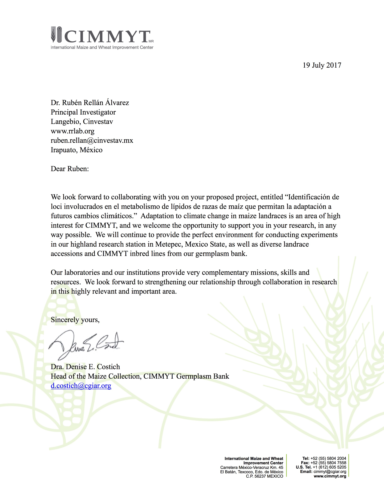
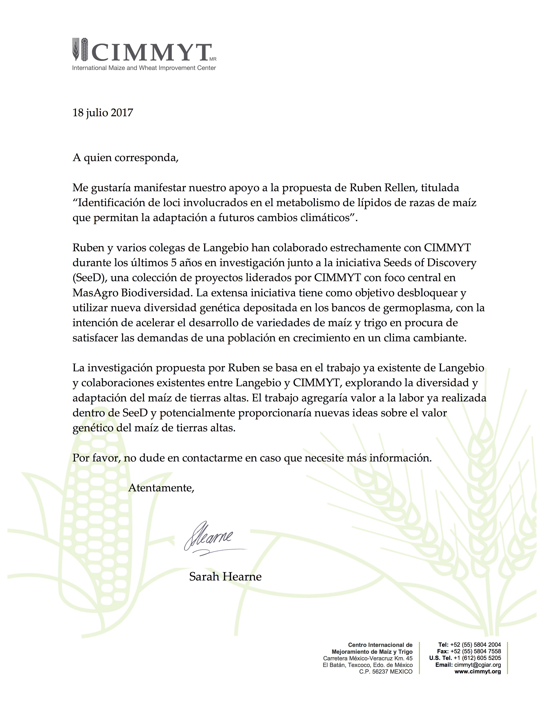

<!-- break -->
 
<!-- break -->

## Identificación de loci involucrados en el metabolismo de lípidos de razas de maíz que permitan la adaptación a futuros cambios climáticos.  

### Cartas Apoyo Proyecto de Atención a Problemas Nacionales.  

----

**Unisem**
  
**INIFAP**

  
**Cimmyt-Costich**

  
**Cimmyt-Hearne**

  

