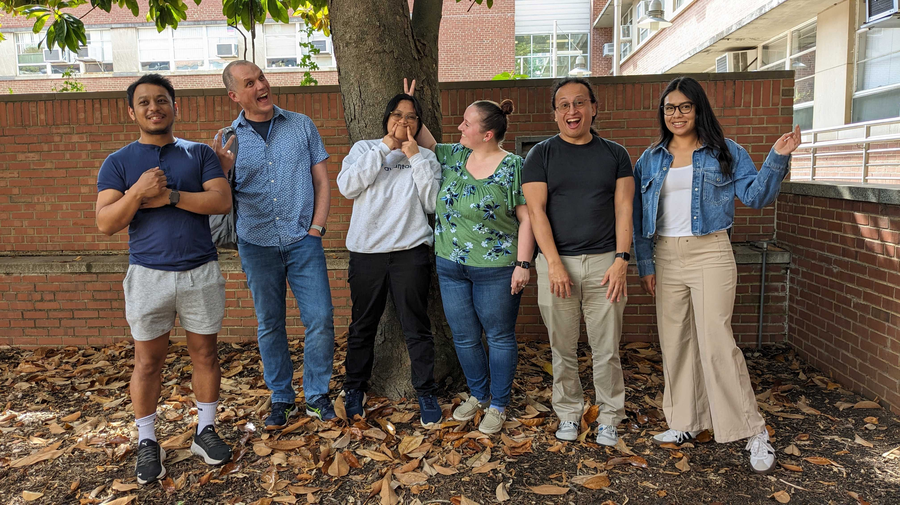
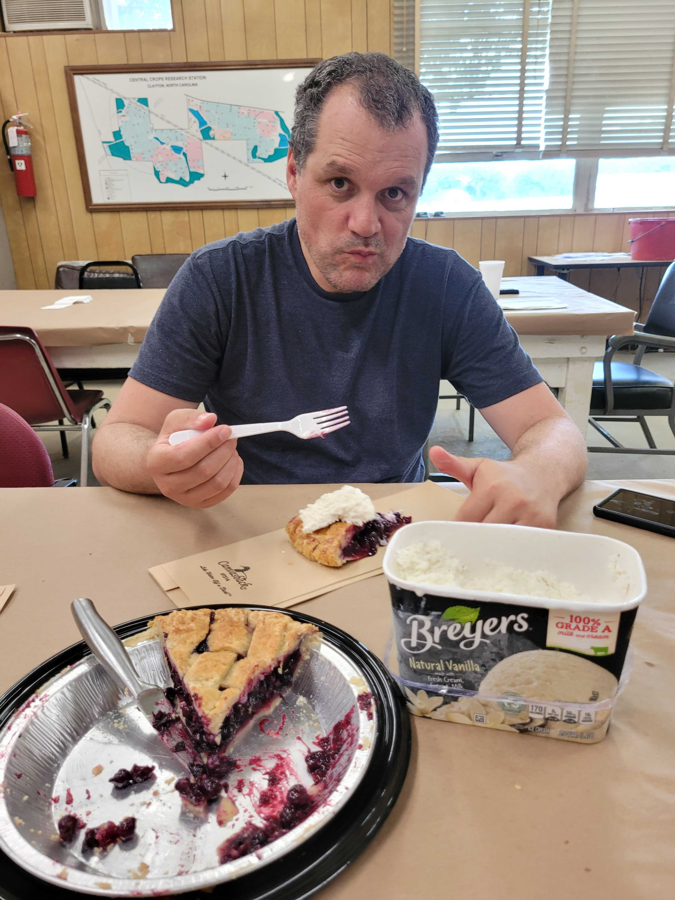
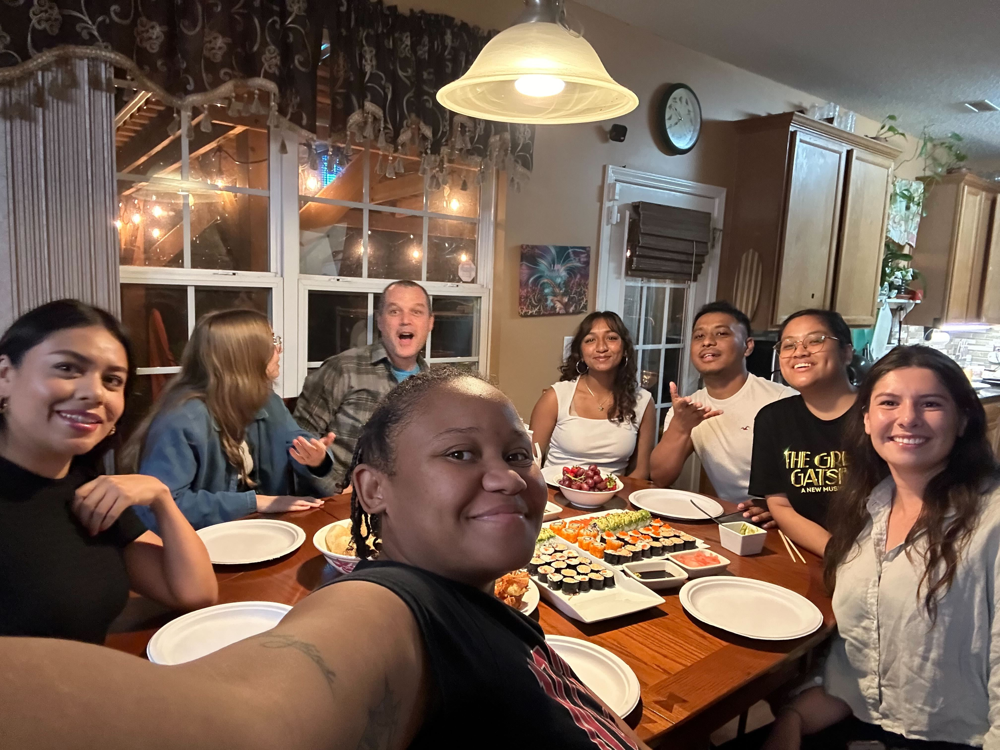
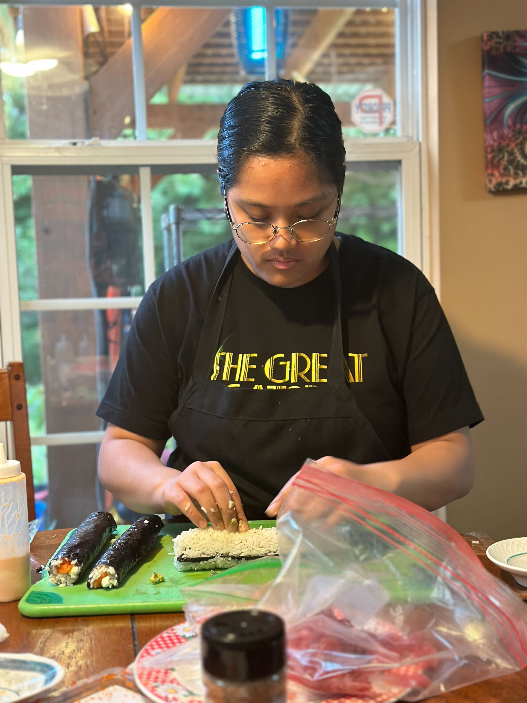
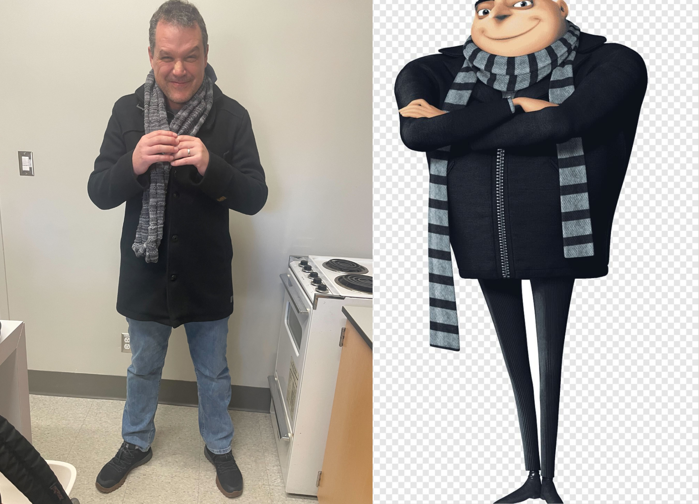
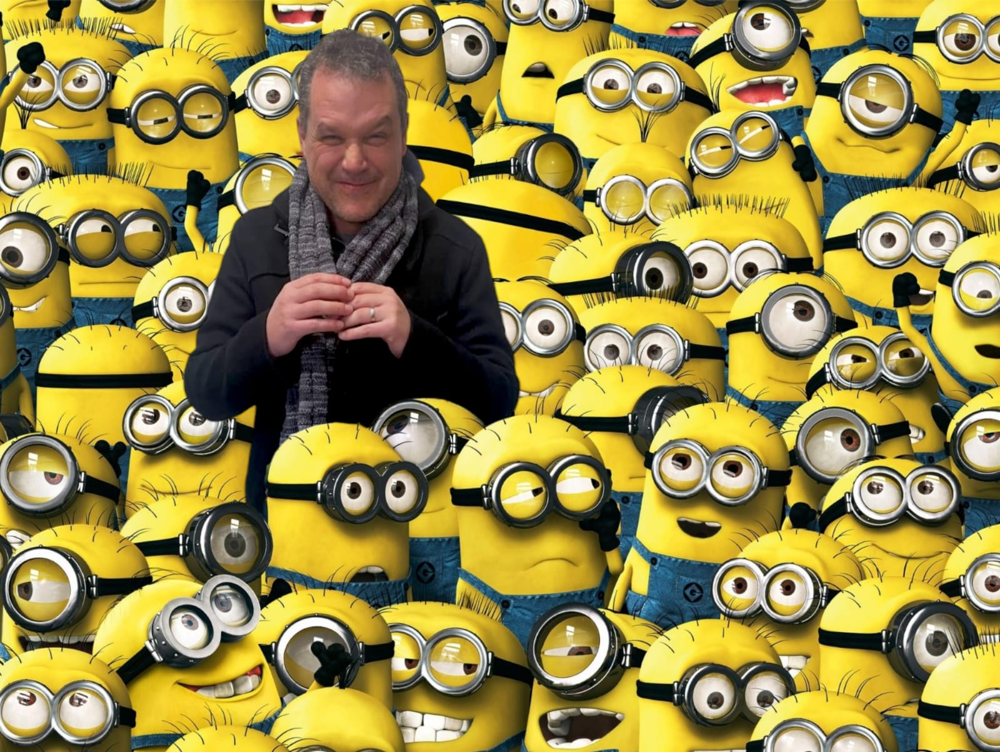
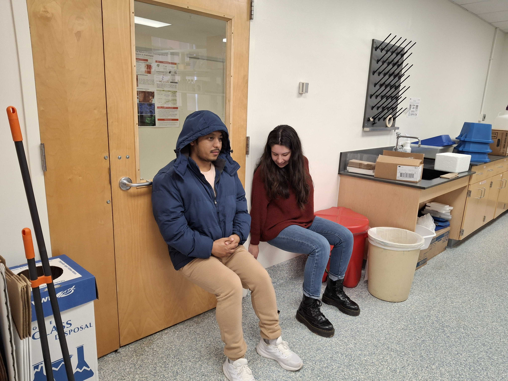

---
<!-- Collage Style Photo Album -->

<!-- Image Gallery -->

  <!-- First row of images -->
  
  
  
  
  
  

  <!-- Second row of images -->
  
  
  
  

  <!-- Third row of images -->
  
  

  <!-- Fourth row of images -->
  
  
 
   <!-- Fifth row of images -->
  
  

  <!-- Sixth row of images -->
  
  

